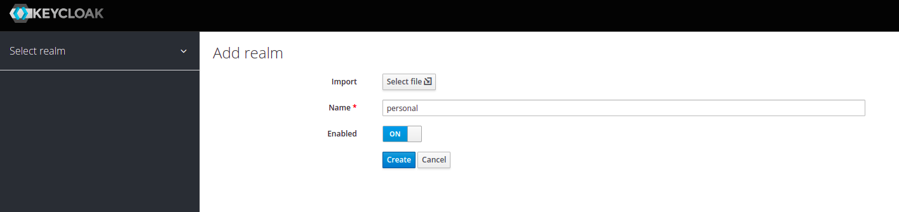
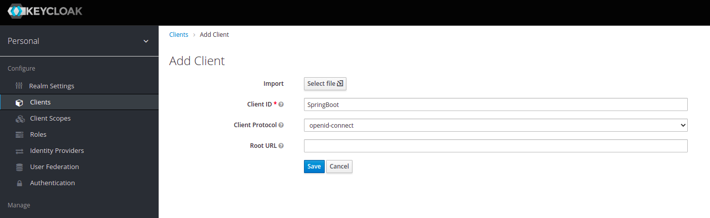
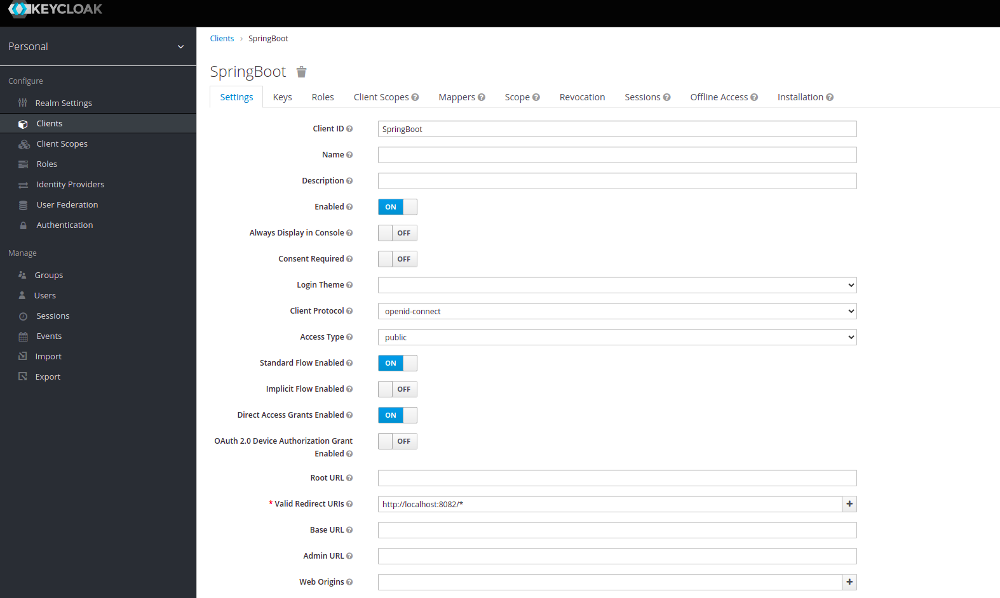
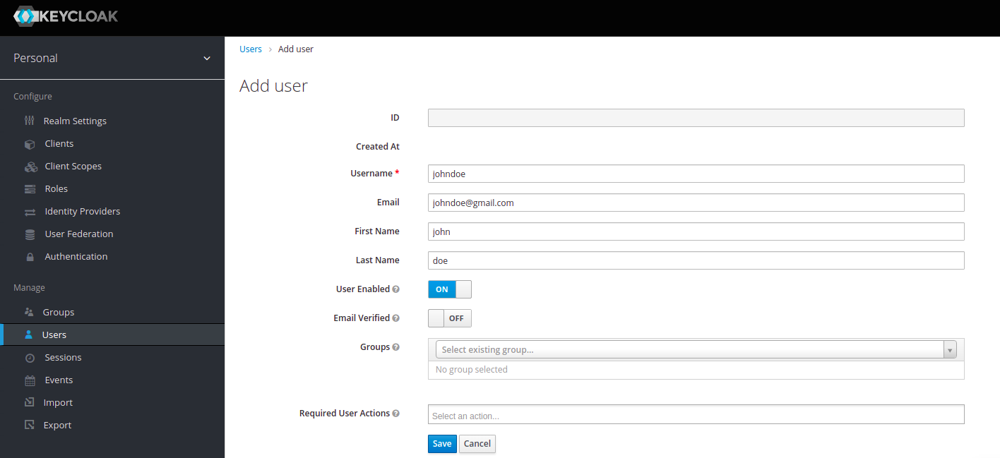
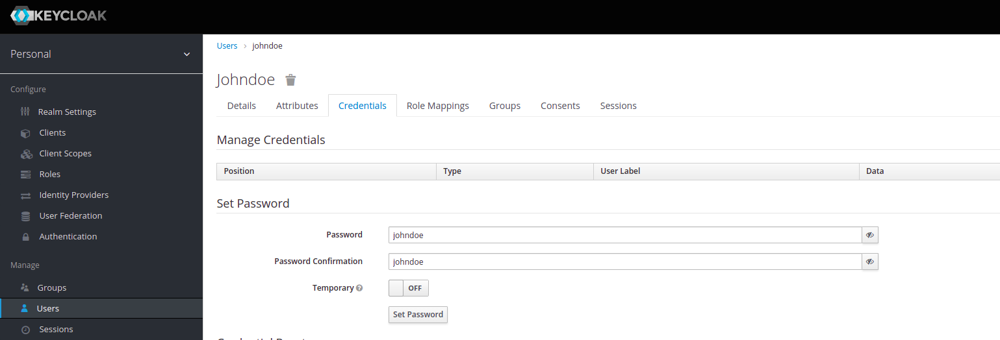
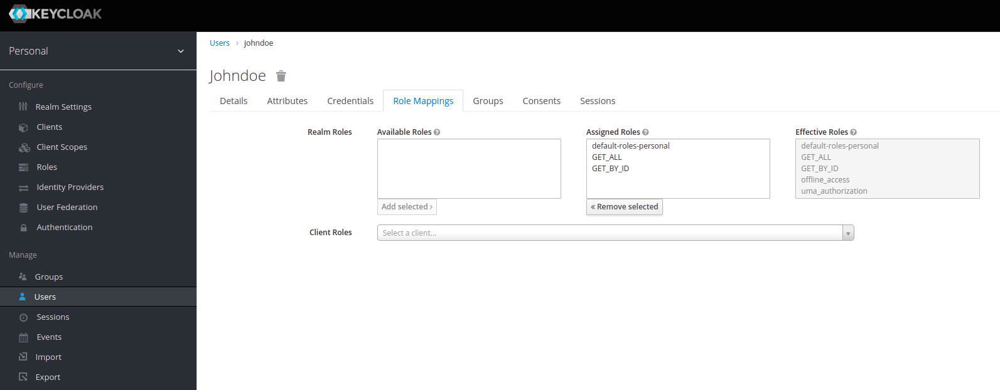

# Spring Boot Oauth2

## Prerequisite

 1. Port 8081, 8082, 679
 2. docker-compose 
 
 ## Getting Started
1. `sudo docker-compose up`
2. Prepare Keycloak configuration `http://localhost:8081`  (Admin / Admin)
3. Create `personal` realm
 
4. Create `SpringBoot` client
 
5. Edit `johndoe` user
 
6. Create `johndoe` user
 
7. Set password
 
8. Create `GET_ALL` & `GET_BY_ID` roles
 
9. Mapping roles to `johndoe` user
 

## Run Resource Server App
Located in `resource-server` folder

